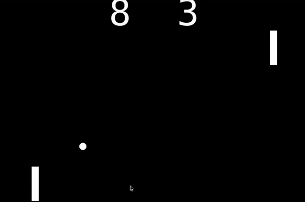

<h1 align="center"> 
Pong </h1>

 
  

Brownian motion is defined as the uncontrolled or erratic movement of particles in a fluid due to their constant collision with other fast-moving molecules. 
Using picture.py graphical library in python, I tried to simulate these eratic motions using simple python codes.

